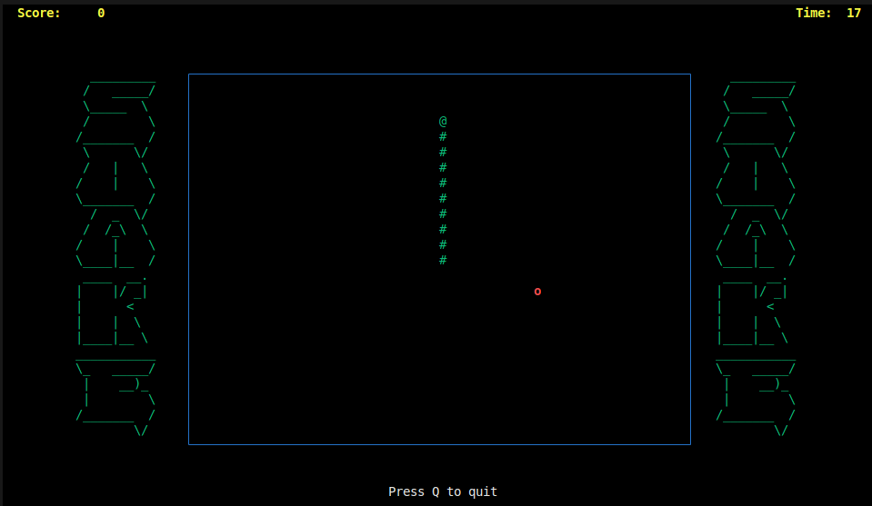

# [Snake](https://github.com/SnakeUnibo/snake)

## Riguardo al progetto
Questo è un progetto sviluppato da 3 studenti dell'Università di Bologna per il corso di programmazione.
Le specifiche del progetto consistevano nel creare un semplice clone, basato sul terminale, del gioco snake tramite il linguaggio di programmazione C++, utilizzando specificamente la libreria grafica *ncurses* e i concetti base riguardanti la programmazione imparati a lezione. 

### Struttura della codebase
Il progetto è stato strutturato e sviluppato seguendo il framework di sviluppo **`MVC`**, con la cartella *`/src`* che contiene:
- il file principale *`main.cpp` che è il punto di partenza del programma;
- la cartella *`/game`* dove si trovano tutte le classi che gestiscono la logica del gioco e la sezione di controllo (*seguendo il framework MVC*);
-  la cartella *`/graphics`* dove risiedono le classi necessarie per la visualizzazione delle varie componenti grafiche.

## Installazione delle dipendenze e setup del progetto
### Linux
Per compilare il progetto sono richiesti i seguenti passaggi:
* Assicurarsi di aver installato la libreria `ncurses` sulla propria macchina
* Assicurarsi di aver correttamente configurato il compilatore GCC (o in alternativa Clang)
* Installare e configurare il progetto tramite CMake (con VSCode è possibile utilizzare l'estensione *`CMake Tools`* per semplificare il processo)

### Windows
Su Windows il progetto può essere compilato grazie ad MSYS:
* Installare MSYS dal sito ufficiale
* Aggiungere il percorso `/usr/bin/`, presente all'interno della cartella di MSYS, alle variabili d'ambiente
* Aprire il terminale MSYS (quello rosa) ed eseguire il comando `pacman -S gcc ncurses-devel base-devel`
* Ora è possibile effettuare il setup del progetto utilizzando l'eseguibile gcc di MSYS

Dopo aver correttamente compilato il progetto utilizzando CMake (senza errori), è possibile far partire il gioco che mostrerà *la seguente interfaccia sullo schermo del terminale*:
    

## Come giocare
Dopo aver aperto il file eseguibile, all'utente verrà mostrata la schermata principale, dove può:
* Premere Play:
    * dopo aver premuto il pulsante Play, verrà mostrata una lista di livelli disponibili dipendenti dalla difficoltà, premendo uno di essi, inizierà il gioco
    * premendo `Q` sulla tastiera è possibile **fermare il gioco**, per poi decidere se continuarlo (*`Resume`*) oppure tornare al menù principale (*`Exit`*)
* Impostare la difficoltà:
    * premendo il secondo pulsante, è possibile impostare la difficoltà desiderata (*`Easy`*,*`Normal`* e *`Hard`*)   
* Controllare la leaderboard:
    * premere il terzo bottone, porterà ad una schermata dove viene mostrata la leaderboard; è possibile uscirne premendo `Q`
* Uscire dal programma
    * il pulsante `Exit` permette di chiudere il programma in maniera sicura

## Autori 
* Caprini Federico [*aintDatCap*](https://github.com/aintDatCap)
* Grillini Leonardo [*LeonardoGrillini*](https://github.com/LeonardoGrillini)
* Hossain Ababil [*AbaSkillzz*](https://github.com/AbaSkillzz)

